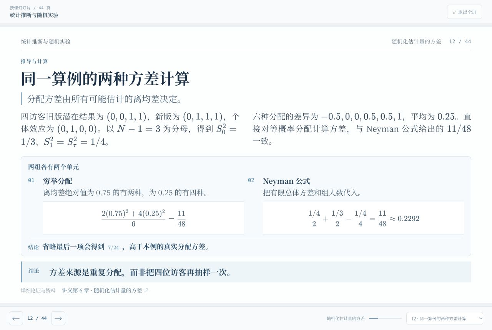

# 十讲授课幻灯片：宋体与独立阅读审核

十讲原有 360 页全部审查，实质修订 138 个原页，新增 43 页，最终共 **403 页**。各讲页数为 37、33、38、43、45、44、39、42、37、45。

## 字体

中文标题、正文、表格及图示使用随站加载的思源宋体字形，含常规与加粗两种字重。字形子集按当前全部幻灯片生成，覆盖 1,102 个中文字符，零缺字；两个字体文件共约 589 KiB。修改后的子集名称为 BDM Course Song，保留 SIL OFL 1.1 授权和版权声明。数学公式保留 KaTeX 数学字体，代码保留等宽字体并使用宋体显示中文注释。

## 独立阅读

逐页检查首次术语与符号、前提、推导衔接、例题输入、计算步骤、管理解释和证据边界。幻灯片给出理解结论所需的主体论证；每页仍可跳转到讲义对应小节阅读进一步的细节。

实质补充包括：期望损失公式的读法、联合概率与贝叶斯更新、两期维护完整题设和逆推、第三范式的函数依赖闭包、SQL 逐行结果、缺失加权恢复与测量衰减、Little 定律的面积计数、排队波动算例、随机化潜在结果与分配穷举、方差的两种验算、固定与持续覆盖的精度比较、共形覆盖的秩论证、双重稳健的两种抵消证明、完整库存数据与整数模型、可手算的微型事件日志和 Petri 令牌状态。

[最终内容审计](independent-reading/final-content-audit.json)记录全部 403 页的审核覆盖与来源哈希。三组记录：[第 1–3 讲](independent-reading/audit-01-03.json)、[第 4–6 讲](independent-reading/audit-04-06.json)、[第 7–10 讲](independent-reading/audit-07-10.json)。123 项数值、数据与 SQL 复算全部通过；当前 1,960 处 TeX 及全部讲义锚点检查无错误。

## 实际浏览器排版

采用 1280 × 720 逻辑画布，逐页浏览全部 45 组画面，覆盖 403 页。对密集表格和算例调整构图与间距；正文采用 23px，紧凑页采用 21px。保持公式、结论与讲义出处可见，避免用隐藏溢出的方式处理密集内容。

[逐页布局记录](independent-reading/layout-audit.json)保存最终浏览器尺寸、字体加载状态、数学解析结果及画面索引。最终全部页面无水平或纵向内容溢出，无数学渲染错误；所有课堂解析展开后完整位于画布内。投影模式放大核查随机化方差、库存表格和 Petri 令牌算例。手机 390 × 844 检查自然高度、17px 宋体及页面宽度；横向公式和表格只在自身容器滚动。

本轮保留并核查页码选择、键盘翻页和授课模式开合。上一轮内容与交互记录保留在 [360 页审核报告](report-previous-360.md)。

## 全部最终画面

- [第 1–9 页](independent-reading/contact-sheets/contact-00.png)
- [第 10–18 页](independent-reading/contact-sheets/contact-01.png)
- [第 19–27 页](independent-reading/contact-sheets/contact-02.png)
- [第 28–36 页](independent-reading/contact-sheets/contact-03.png)
- [第 37–45 页](independent-reading/contact-sheets/contact-04.png)
- [第 46–54 页](independent-reading/contact-sheets/contact-05.png)
- [第 55–63 页](independent-reading/contact-sheets/contact-06.png)
- [第 64–72 页](independent-reading/contact-sheets/contact-07.png)
- [第 73–81 页](independent-reading/contact-sheets/contact-08.png)
- [第 82–90 页](independent-reading/contact-sheets/contact-09.png)
- [第 91–99 页](independent-reading/contact-sheets/contact-10.png)
- [第 100–108 页](independent-reading/contact-sheets/contact-11.png)
- [第 109–117 页](independent-reading/contact-sheets/contact-12.png)
- [第 118–126 页](independent-reading/contact-sheets/contact-13.png)
- [第 127–135 页](independent-reading/contact-sheets/contact-14.png)
- [第 136–144 页](independent-reading/contact-sheets/contact-15.png)
- [第 145–153 页](independent-reading/contact-sheets/contact-16.png)
- [第 154–162 页](independent-reading/contact-sheets/contact-17.png)
- [第 163–171 页](independent-reading/contact-sheets/contact-18.png)
- [第 172–180 页](independent-reading/contact-sheets/contact-19.png)
- [第 181–189 页](independent-reading/contact-sheets/contact-20.png)
- [第 190–198 页](independent-reading/contact-sheets/contact-21.png)
- [第 199–207 页](independent-reading/contact-sheets/contact-22.png)
- [第 208–216 页](independent-reading/contact-sheets/contact-23.png)
- [第 217–225 页](independent-reading/contact-sheets/contact-24.png)
- [第 226–234 页](independent-reading/contact-sheets/contact-25.png)
- [第 235–243 页](independent-reading/contact-sheets/contact-26.png)
- [第 244–252 页](independent-reading/contact-sheets/contact-27.png)
- [第 253–261 页](independent-reading/contact-sheets/contact-28.png)
- [第 262–270 页](independent-reading/contact-sheets/contact-29.png)
- [第 271–279 页](independent-reading/contact-sheets/contact-30.png)
- [第 280–288 页](independent-reading/contact-sheets/contact-31.png)
- [第 289–297 页](independent-reading/contact-sheets/contact-32.png)
- [第 298–306 页](independent-reading/contact-sheets/contact-33.png)
- [第 307–315 页](independent-reading/contact-sheets/contact-34.png)
- [第 316–324 页](independent-reading/contact-sheets/contact-35.png)
- [第 325–333 页](independent-reading/contact-sheets/contact-36.png)
- [第 334–342 页](independent-reading/contact-sheets/contact-37.png)
- [第 343–351 页](independent-reading/contact-sheets/contact-38.png)
- [第 352–360 页](independent-reading/contact-sheets/contact-39.png)
- [第 361–369 页](independent-reading/contact-sheets/contact-40.png)
- [第 370–378 页](independent-reading/contact-sheets/contact-41.png)
- [第 379–387 页](independent-reading/contact-sheets/contact-42.png)
- [第 388–396 页](independent-reading/contact-sheets/contact-43.png)
- [第 397–403 页](independent-reading/contact-sheets/contact-44.png)
