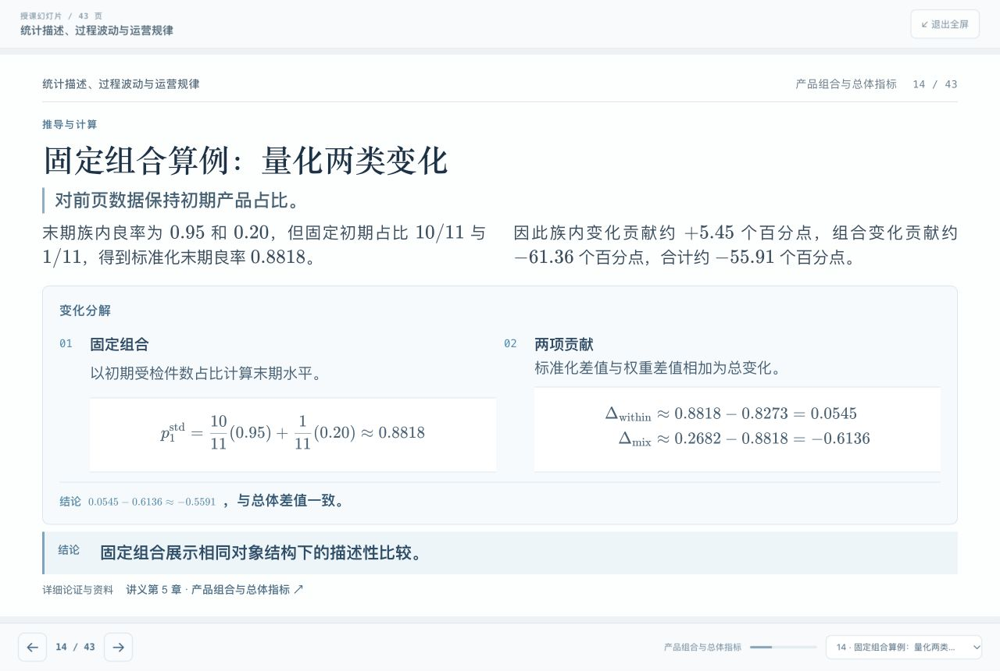
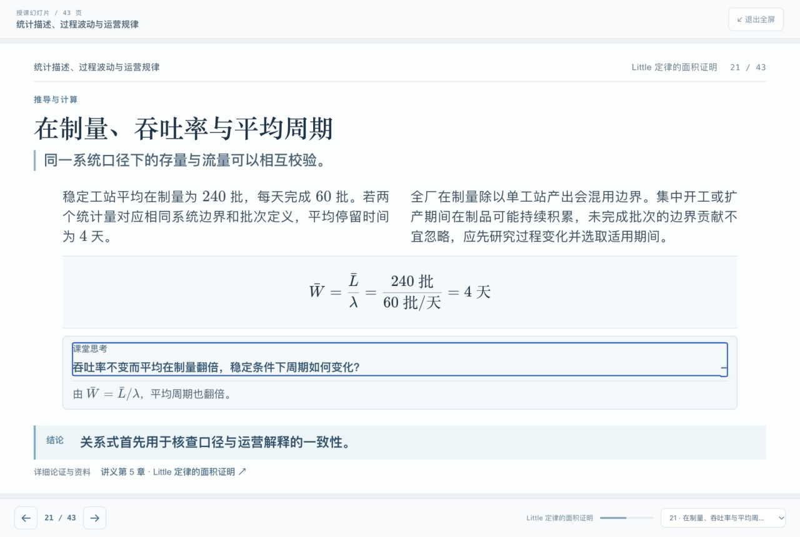

# 十讲授课幻灯片审核

原有 312 页逐页复核，修订后共 360 页。十讲页数为 32、31、35、41、43、39、31、36、33、39。所有页面具备讲义对应小节的有效链接。

## 内容

逐页检查概念、假设、结论、推导、算例与学术表述，保留完整课堂讲授路径。补充边界解、CARA 合同推导、异质节拍 OEE、WIP 时间权重、部分识别约束、组合变化、随机化无偏性与方差、共形预测边界、因果识别与双重稳健、优化并列解和流程证据边界。数值结果结合课程程序、精确算术或独立枚举核查。

[内容审核记录](content-audit.json) 覆盖全部 312 个原页及各组新增页。根代理又独立复核新增的识别边界和标准化页，修正充分条件与必要条件、估计量与总体效应的区分。

## 构图与渲染

使用 1280 × 720 逻辑画布。标题与主旨固定在上方，解释与推导按 split、stack、focus 三种构图组织，结论和讲义出处固定在下方。长表拆页，双步骤算例横排，SQL 代码获得更宽空间，过密的公式和例题另页展开。

逐页浏览全部 40 组画面，共 360 页；并放大核查计算页与课堂解析展开状态。[版面审核记录](layout-audit.json) 保存每页的实际浏览器尺寸、数学解析结果、画面索引及审查结论。全部页面未发现水平溢出、结论遮挡或数学解析错误；所有课堂解析展开后均在画布内。

手机采用自然高度阅读与 17px 正文，宽公式、表格和代码在自身容器内滚动。实际验证 390 × 844、1280 × 860、1440 × 900。修复了手机按整讲最长页拉伸而产生的额外留白。

## 交互

已验证方向键、首尾跳转、末页禁用、页码选择、授课模式进入和退出、课堂思考开合，以及讲义引用退出授课模式并定位对应小节。授课模式使用整个浏览器视口，兼容内嵌浏览器。

## 完整画面

- [第 1–9 页](contact-sheets/contact-00.png)
- [第 10–18 页](contact-sheets/contact-01.png)
- [第 19–27 页](contact-sheets/contact-02.png)
- [第 28–36 页](contact-sheets/contact-03.png)
- [第 37–45 页](contact-sheets/contact-04.png)
- [第 46–54 页](contact-sheets/contact-05.png)
- [第 55–63 页](contact-sheets/contact-06.png)
- [第 64–72 页](contact-sheets/contact-07.png)
- [第 73–81 页](contact-sheets/contact-08.png)
- [第 82–90 页](contact-sheets/contact-09.png)
- [第 91–99 页](contact-sheets/contact-10.png)
- [第 100–108 页](contact-sheets/contact-11.png)
- [第 109–117 页](contact-sheets/contact-12.png)
- [第 118–126 页](contact-sheets/contact-13.png)
- [第 127–135 页](contact-sheets/contact-14.png)
- [第 136–144 页](contact-sheets/contact-15.png)
- [第 145–153 页](contact-sheets/contact-16.png)
- [第 154–162 页](contact-sheets/contact-17.png)
- [第 163–171 页](contact-sheets/contact-18.png)
- [第 172–180 页](contact-sheets/contact-19.png)
- [第 181–189 页](contact-sheets/contact-20.png)
- [第 190–198 页](contact-sheets/contact-21.png)
- [第 199–207 页](contact-sheets/contact-22.png)
- [第 208–216 页](contact-sheets/contact-23.png)
- [第 217–225 页](contact-sheets/contact-24.png)
- [第 226–234 页](contact-sheets/contact-25.png)
- [第 235–243 页](contact-sheets/contact-26.png)
- [第 244–252 页](contact-sheets/contact-27.png)
- [第 253–261 页](contact-sheets/contact-28.png)
- [第 262–270 页](contact-sheets/contact-29.png)
- [第 271–279 页](contact-sheets/contact-30.png)
- [第 280–288 页](contact-sheets/contact-31.png)
- [第 289–297 页](contact-sheets/contact-32.png)
- [第 298–306 页](contact-sheets/contact-33.png)
- [第 307–315 页](contact-sheets/contact-34.png)
- [第 316–324 页](contact-sheets/contact-35.png)
- [第 325–333 页](contact-sheets/contact-36.png)
- [第 334–342 页](contact-sheets/contact-37.png)
- [第 343–351 页](contact-sheets/contact-38.png)
- [第 352–360 页](contact-sheets/contact-39.png)
