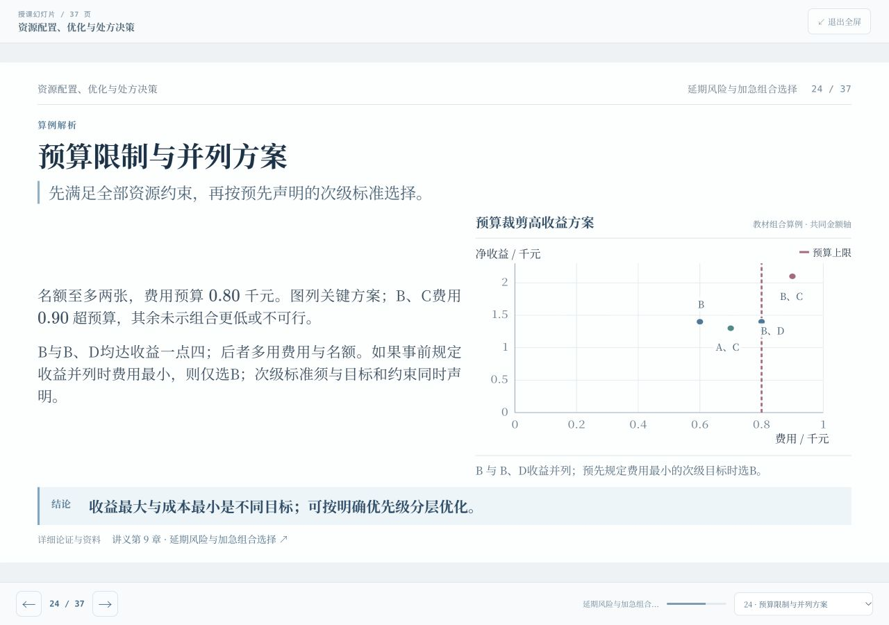
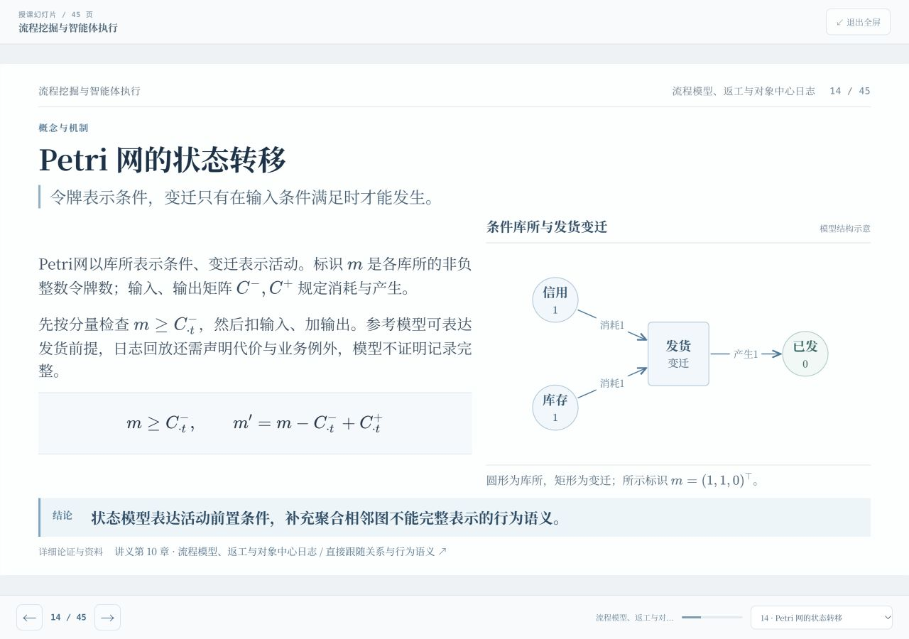
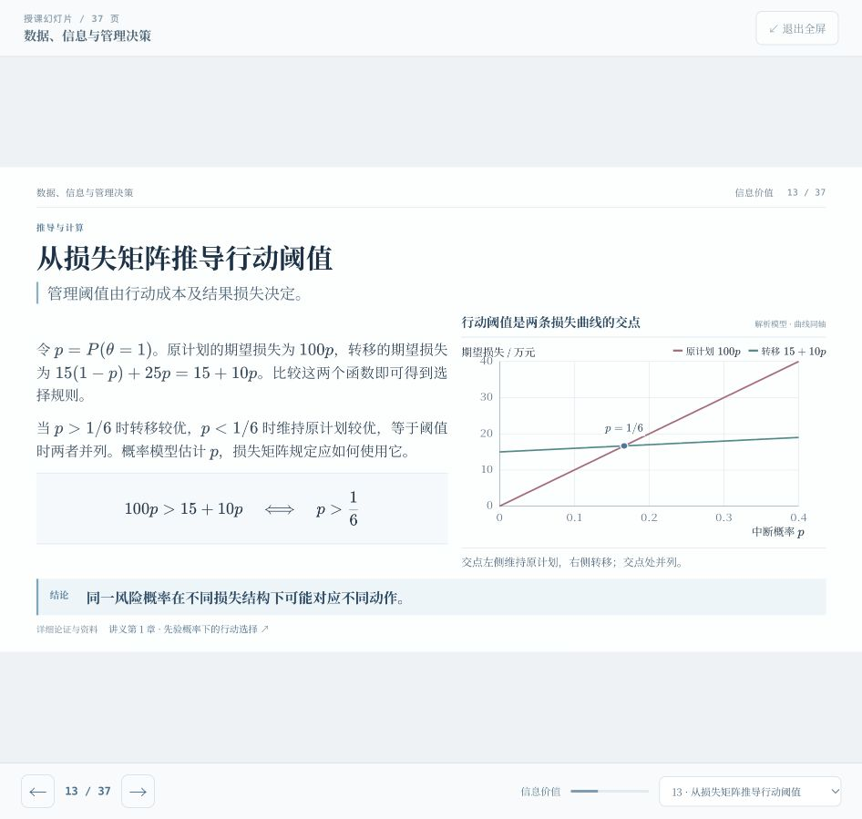

# 十讲幻灯片图解与可视化审核

本轮保持十讲 **403页**，新增 **152幅教学图解**，覆盖概念结构、数量比较、统计区间、条件决策、时间窗口、因果路径、可行域和流程状态。主体说明继续保留问题条件、符号定义、推导步骤、结论及讲义定位。

## 图解与数量编码

采用56幅结构图、33幅数量条形图、15幅矩阵、29幅坐标图、12幅时间轴和7幅区间图。数量图使用共同坐标与单位，条形以零为基准，曲线及区域由实际数值坐标构造。示意关系、解析模型、教学数值与教材实验数据分别标注，不把结构图的枝长误解为概率或时间。每幅图均有图名、编码说明、结论解读和无障碍文字解释。

[图解定义与来源：1–3讲](diagram-redesign/notes-01-03.md)、[4–6讲](diagram-redesign/notes-04-06.md)、[7–10讲](diagram-redesign/notes-07-10.md)。

## 内容与计算复核

依据课程讲义逐项核对新增图解的概念关系和数值，重点复算信息价值、概率更新、比率聚合、缺失加权、队列成本、随机化方差、置信区间、预测损失、因果估计、库存组合与流程日志。独立复核记录：[1–3讲](diagram-redesign/review-01-03.md)、[4–6讲与渲染器](diagram-redesign/renderer-review.md)、[7–10讲](diagram-redesign/review-07-10.md)。[最终修正](diagram-redesign/final-corrections.md)说明定义、表述与布局的具体修订。

`node scripts/verify-slides.mjs`检查十讲403页、2060处TeX及讲义定位，无错误。`node scripts/verify-diagrams.mjs`核验全部152幅图的数据、量尺、节点和路径，无错误。`node scripts/verify-diagram-renderer.mjs`独立核对六种渲染方式的坐标转换、负值基线、区间端点、区域顶点、矩阵色阶和箭头边界。[完整图解验证结果](diagram-redesign/diagram-validation.json)。

## 逐页视觉与交互

采用1280×720逻辑授课画布，分45组实际查看403个不同页面；[第1–135页](diagram-redesign/visual-00-14.md)、[第136–270页](diagram-redesign/visual-15-29.md)、[第271–403页](diagram-redesign/visual-30-44.md)。联系表复核构图、裁切和关系，另外全屏核查关键数量图、曲线与状态图。

[最终浏览器布局记录](diagram-redesign/layout-audit.json)核查全部页面：无正文溢出，无KaTeX错误，无图标签碰撞；课堂解析展开后均位于画布内。实际检验页码选择、左右键翻页、全屏开合，以及返回讲义对应小节。390×844手机阅读保持自然高度与宋体正文，页面总宽为390px，宽图只在自身容器横向滚动。

宋体常规与加粗两个字体子集共610388字节，覆盖1116个中文字符，零缺字；数学使用KaTeX，代码保留等宽字体。`npm run build`与`git diff --check`通过。[来源及产物哈希](diagram-redesign/manifest.json)。

前一轮完整内容与独立阅读记录保留于[宋体与独立阅读审核](report-independent-reading.md)。

## 线上发布验证

GitHub Pages 本次发布流程 [38051242563](https://github.com/Cosmos-1989/big-data-and-management-decision/actions/runs/38051242563) 成功，发布提交为 `7dae9c379c70f5e41f146956d3e823dc57fa9153`。严格HTTPS下载核对9项核心文件（首页、脚本、图解、内容、CSS、字体清单和两字重字体），均为200且与本地成品逐字节一致。[核对记录](diagram-redesign/public-release.json)。线上第1讲已实际加载37页、15幅新增图解，无数学错误与浏览器控制台错误；全屏查看行动阈值曲线。

## 全部最终画面

- [第1–9页](diagram-redesign/contact-sheets/contact-00.png)
- [第10–18页](diagram-redesign/contact-sheets/contact-01.png)
- [第19–27页](diagram-redesign/contact-sheets/contact-02.png)
- [第28–36页](diagram-redesign/contact-sheets/contact-03.png)
- [第37–45页](diagram-redesign/contact-sheets/contact-04.png)
- [第46–54页](diagram-redesign/contact-sheets/contact-05.png)
- [第55–63页](diagram-redesign/contact-sheets/contact-06.png)
- [第64–72页](diagram-redesign/contact-sheets/contact-07.png)
- [第73–81页](diagram-redesign/contact-sheets/contact-08.png)
- [第82–90页](diagram-redesign/contact-sheets/contact-09.png)
- [第91–99页](diagram-redesign/contact-sheets/contact-10.png)
- [第100–108页](diagram-redesign/contact-sheets/contact-11.png)
- [第109–117页](diagram-redesign/contact-sheets/contact-12.png)
- [第118–126页](diagram-redesign/contact-sheets/contact-13.png)
- [第127–135页](diagram-redesign/contact-sheets/contact-14.png)
- [第136–144页](diagram-redesign/contact-sheets/contact-15.png)
- [第145–153页](diagram-redesign/contact-sheets/contact-16.png)
- [第154–162页](diagram-redesign/contact-sheets/contact-17.png)
- [第163–171页](diagram-redesign/contact-sheets/contact-18.png)
- [第172–180页](diagram-redesign/contact-sheets/contact-19.png)
- [第181–189页](diagram-redesign/contact-sheets/contact-20.png)
- [第190–198页](diagram-redesign/contact-sheets/contact-21.png)
- [第199–207页](diagram-redesign/contact-sheets/contact-22.png)
- [第208–216页](diagram-redesign/contact-sheets/contact-23.png)
- [第217–225页](diagram-redesign/contact-sheets/contact-24.png)
- [第226–234页](diagram-redesign/contact-sheets/contact-25.png)
- [第235–243页](diagram-redesign/contact-sheets/contact-26.png)
- [第244–252页](diagram-redesign/contact-sheets/contact-27.png)
- [第253–261页](diagram-redesign/contact-sheets/contact-28.png)
- [第262–270页](diagram-redesign/contact-sheets/contact-29.png)
- [第271–279页](diagram-redesign/contact-sheets/contact-30.png)
- [第280–288页](diagram-redesign/contact-sheets/contact-31.png)
- [第289–297页](diagram-redesign/contact-sheets/contact-32.png)
- [第298–306页](diagram-redesign/contact-sheets/contact-33.png)
- [第307–315页](diagram-redesign/contact-sheets/contact-34.png)
- [第316–324页](diagram-redesign/contact-sheets/contact-35.png)
- [第325–333页](diagram-redesign/contact-sheets/contact-36.png)
- [第334–342页](diagram-redesign/contact-sheets/contact-37.png)
- [第343–351页](diagram-redesign/contact-sheets/contact-38.png)
- [第352–360页](diagram-redesign/contact-sheets/contact-39.png)
- [第361–369页](diagram-redesign/contact-sheets/contact-40.png)
- [第370–378页](diagram-redesign/contact-sheets/contact-41.png)
- [第379–387页](diagram-redesign/contact-sheets/contact-42.png)
- [第388–396页](diagram-redesign/contact-sheets/contact-43.png)
- [第397–403页](diagram-redesign/contact-sheets/contact-44.png)
